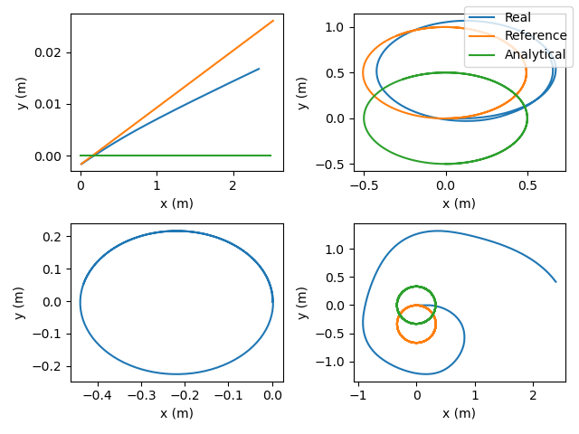

# Homework 1

## Igor Alentev BS20-RO-01

Our goal was to simulate the system with the following requirements:

- $v = 0.5\; \omega=0$
- $v = 1.0\; \omega=2$
- $v = 0.0\; \omega=2$
- $\omega_L = 20.0\; \omega_R=18.0$

